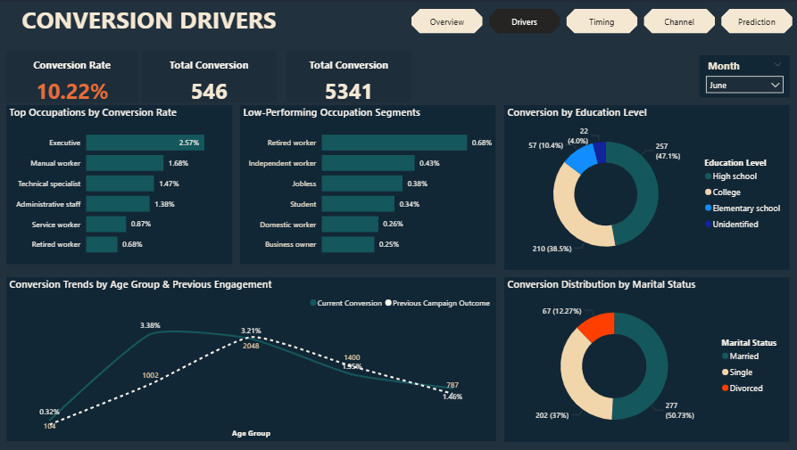
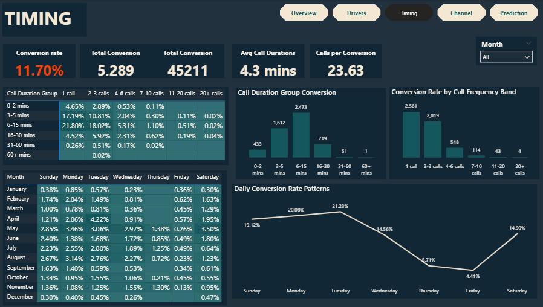

# 📊 Insurance Campaign Performance Analysis
 
> **Strategic Dashboard & Conversion Intelligence Using Power BI + DAX**

---

## 🧭 Executive Summary

In 2019, a national insurance provider launched a large-scale telemarketing campaign to acquire new customers. Despite making **45,211 outbound calls**, the campaign yielded only **5,289 conversions**, reflecting a modest **11.7% conversion rate** and an average of **23.63 calls per conversion**.

Through advanced segmentation, behavior analytics, and timing optimization in Power BI, this project reveals how to **elevate conversion rates by 10–15%** by shifting from mass outreach to **precision targeting**.

### 🚀 Key Outcomes

- 🎯 **Identified top-converting personas** (e.g., married executives aged 25–34 using mobile) with **2x higher conversion** than campaign average.
- 🕒 **Defined optimal contact timing**: Monday–Tuesday, 6–15 minute calls, 2–3 attempts.
- ⚠️ **Flagged inefficiencies**: landline contacts, students, and Friday calls drove high cost per conversion.

---

## 📚 Table of Contents

1. [🎯 Project Title & Problem Statement](#-project-title--problem-statement)  
2. [📊 Data Description](#-data-description)  
3. [⚙️ Methodology](#-methodology)
4. [🧠 DAX Feature Engineering](#-dax-feature-engineering)  
5. [📈 Key Visuals](#-key-visuals)  
6. [🔍 Strategic Insights](#-strategic-insights)  
7. [📝 Business Recommendations](#-business-recommendations)  
8. [🧰 Tools & GitHub Repository](#-tools--github-repository)  
9. [🏁 Business Impact & Reflection](#-business-impact--reflection)  


## 🎯 Project Title & Problem Statement

### **Title:**  
**Customer Conversion Intelligence for Insurance Campaign Optimization**

### **Problem Statement:**  
Despite making 45,211 outbound calls, the insurer achieved only an 11.7% conversion rate, with 23.63 calls required per successful sale.

### **Challenges Identified:**

- ❓ **Unclear segmentation**: What traits actually drive conversions?
- 💸 **High cost per sale**: Inefficient call strategy and poor targeting.

### **Business Objective:**  
Uncover data-driven answers to:

- Who are the most responsive customers?
- What channels and timing yield the highest ROI?
- How can we optimize conversion without increasing call volume?

---

## 📊 Data Description

### **Dataset Overview**

- 📁 **Source:** The dataset used in this project is sourced from [Kaggle](https://www.kaggle.com) and included in this repository for convenience. 
- 🔢 **Volume:** 45,211 call records  
- 🎯 **Target Variable:** `conversion_status` (Yes/No)
- You can download the dataset directly from  [`Here`](./MARKETING%20DATASET.csv/)
[📥 **Download Dataset:** [Click here to download CSV](https://github.com/Elohim00/Insurance-Campaign-Performance/blob/main/MARKETING%20DATASET%20(2).csv)


### **Key Attributes:**

- 👤 Demographics: Age, Marital Status, Occupation, Education  
- 📞 Engagement: Call Duration, Frequency, Call Date  
- 📱 Channel: Mobile, Landline, Unidentified  
- 🕰️ History: Prior campaign results

### **Data Preparation:**

- Cleaned nulls, standardized formatting  
- Binned variables: age, duration, frequency  
- Created derived columns: Weekday, Month, Personas  
- Filtered invalid conversion records to preserve model accuracy

---

## ⚙️ Methodology

### 🧪 Exploratory Data Analysis (EDA)

- Segment-wise analysis across demographics, behavior, and channel
- Correlation assessment of variables with conversion likelihood
- Created persona-based views and funnel performance breakdowns

### 📈 Modeling & Visualization Tools

- **Power BI** for dynamic, drillable dashboards  
- **DAX** for engineered KPIs and segmentation logic  
- **Excel/CSV** for initial wrangling

---

## 🧠 DAX Feature Engineering
## 📐 DAX Measures

```DAX
-- Age Buckets
AgeGroup =
    SWITCH (
        TRUE (),
        [age] <= 24, "18–24",
        [age] <= 34, "25–34",
        [age] <= 44, "35–44",
        [age] <= 54, "45–54",
        [age] <= 64, "55–64",
        "65+"
    )

-- Call Duration Segments
CallDurationGroup =
    SWITCH (
        TRUE (),
        [call_duration] <= 2, "0–2 min",
        [call_duration] <= 5, "3–5 min",
        [call_duration] <= 15, "6–15 min",
        [call_duration] <= 30, "16–30 min",
        "31+ min"
    )

-- Frequency Group
CallFrequencyGroup =
    SWITCH (
        TRUE (),
        [call_frequency] = 1, "1 call",
        [call_frequency] <= 3, "2–3 calls",
        [call_frequency] <= 6, "4–6 calls",
        [call_frequency] <= 10, "7–10 calls",
        "11+ calls"
    )

-- Weekday & Month
CallWeekday = FORMAT([call_date], "dddd")
CallMonth = FORMAT([call_date], "MMMM")

-- Conversion Binary Flag
Converted = IF([conversion_status] = "Yes", 1, 0)

-- Persona Creation
Persona =
    'Marketing Dataset'[Marital_Status] & " - " &
    'Marketing Dataset'[Occupation] & " - " &
    'Marketing Dataset'[AgeGroup] & " - " &
    'Marketing Dataset'[channel]
```


# 📈 Key Visuals

## 📊 Dashboard Highlights

📌 **Executive Overview (KPIs + Summary)**  

 


📌 **Conversion Drivers by Persona**

 

📌 **Best Call Timing Heatmap**

 


📌 **Channel Performance: Mobile vs Landline**

 

---

# 🔍 Strategic Insights

### 🔥 High-Performing Segments
| Persona Attribute | Value     |
| ----------------- | --------- |
| Marital Status    | Married   |
| Occupation        | Executive |
| Age Group         | 25–34     |
| Preferred Channel | Mobile    |
| Conversion Rate   | Over 23%  |

**Engagement Traits:**

* Stable income, high responsiveness
* Engage on Mon/Tue, 6–15 min calls
* Convert within 2–3 attempts

Insights:
This group significantly outperforms all others — converting at over 23%, which is more than twice the campaign average. Their profile indicates stable income and high responsiveness. They engage best on Monday and Tuesday, during 6–15 minute calls, and typically convert within 2–3 attempts. These traits suggest decisiveness and efficiency. This persona is ideal for focused, high-priority outreach with minimal effort and high return.


---

### 🟡 Mid-Performing Segments

| Persona Attribute | Value                  |
| ----------------- | ---------------------- |
| Marital Status    | Mixed (Single/Married) |
| Occupation        | Educated Professionals |
| Age Group         | 35–44                  |
| Preferred Channel | Mixed                  |
| Conversion Rate   | Moderate (\~10–15%)    |

* Educated professionals aged 35–44
* Require 4–6 attempts, longer call durations
* Convert best early in month (March, May, August)
* Suitable for nurture campaigns

*** 
Insights:
These individuals show moderate conversion rates, particularly when contacted early in the month (March, May, August stand out). They tend to require 4–6 call attempts and prefer longer conversations, indicating that while interested, they need more time and touchpoints to make decisions. They are ideal candidates for nurturing campaigns, where education and consistent engagement can lead to conversions over time.**


---

### 🔻 Low-Performing Segments


| Persona Attribute | Value                           |
| ----------------- | ------------------------------- |
| Marital Status    | Mixed                           |
| Occupation        | Students / Unemployed           |
| Age Group         | 18–24                           |
| Preferred Channel | Landline                        |
| Conversion Rate   | <5% (Students), <10% (Landline) |


* Students, unemployed: <5% conversion
* Landline users: <10% of conversions, 7+ call attempts
* Friday outreach = lowest response rates
* High resource drain with poor ROI


Insights:
This segment has the lowest return on investment. Students and unemployed individuals rarely convert, with rates under 5%. Landline users account for less than 10% of conversions, despite requiring 7 or more call attempts. Outreach on Fridays also performs poorly across the board, suggesting timing fatigue. These leads result in high resource usage with minimal return, and efforts here should be minimized or rerouted to automated low-cost channels.


> 📉 Lowest engagement seen on Fridays, especially among landline users.

---

# ⚙️ Operational Inefficiencies

### 📡 Channel Optimization – Strategic Deep Dive

* 📱 **Mobile: 92.63% of all calls**
* ☎️ **Landline: 7.37% of all calls**

We uncover a **critical performance imbalance**:

* 📉 Despite dominating the outreach volume, **Mobile calls convert at just 11.58%**.
* 📈 Meanwhile, **Landline calls — though a small fraction — convert at 13.4%**, revealing an underutilized opportunity.


---

### 💡 Strategic Business Insights

1. **Volume ≠ Value**:
   Mobile calls have scale, but not efficiency. The low conversion rate suggests **message fatigue**, **poor personalization**, or **mismatched timing**.

2. **Landline = Low Volume, High Intent**:
   While landline usage has declined in modern times, those who **still use it are often older, more stable, and likely more decisive** — making them **high-value leads**.

3. **Opportunity Cost**:
   Relying too heavily on mobile without improving the conversion process creates **waste**. A rebalanced strategy could **unlock hidden ROI** from both ends.


> “By optimizing mobile call strategy and selectively scaling landline outreach, the business can **recover wasted volume**, **increase conversion efficiency**, and **improve cost-per-sale — without increasing call count**.”

> ✅ Mobile clearly dominates in conversion rate — optimize budget and resources here.

---

# 📝 Business Recommendations

### 🎯 Persona Targeting
Let’s focus our energy where it truly counts.

✅ Best Converting Persona: Married executives aged 25–34, reachable by mobile. They’re career-focused, decision-ready, and far more responsive.
→ This segment shows the highest conversion rates, making them the most cost-effective to target.

❌ Lower Priority: Students and landline-only contacts. They’re either harder to reach or less likely to convert.
→ Their low engagement and limited decision power lead to higher effort with minimal returns.

### 📆 Timing Strategy
⏰ Timing is everything.

Best days: Monday and Tuesday — people are focused and responsive.
→ Early-week outreach aligns with peak availability and decision-readiness.

Ideal call length: 6–15 minutes — enough to connect, not too long to lose them.
→ Data shows this window hits the sweet spot between rapport-building and efficiency.

## 📞 Channel Optimization

#### 📱 For Mobile — *Fix the Funnel, Don't Just Scale*

* **Rethink mobile scripts**: Shorten, personalize, and emotionally align with the mobile audience (e.g., busy professionals on-the-go).
* **Time matters**: Re-analyze best hours/days for mobile outreach — align with work breaks, commute times, or after hours.
* **Leverage pre-call nudges**: SMS or WhatsApp messages ahead of a call increase recognition and response likelihood.
* **Invest in AI dialers**: Use behavioral data to trigger outreach when users are most receptive.

#### ☎️ For Landline — *Don’t Ignore the Outlier Performer*

* **Double down selectively**: Identify personas that convert via landline (e.g., Executives aged 45+, Married professionals).
* **Design specialized scripts** for landline — calm, value-focused, and longer-format conversations.
* **Use as a fallback**: Route unresponsive mobile leads to a landline attempt for a second-chance conversion.

#### 🔄 Smart Channel Segmentation

| Persona             | Preferred Channel | Rationale                                        |
| ------------------- | ----------------- | ------------------------------------------------ |
| Young professionals | Mobile            | Accessibility, speed, flexibility                |
| Older professionals | Landline          | Stability, familiarity, higher trust             |
| Non-responders      | Channel Rotation  | Switch channels after 2–3 failed mobile attempts |


### ⏱️ Touchpoint Control
Less is more when it comes to follow-ups.

Limit to 2–3 calls per lead to avoid fatigue.
→ Most conversions happen early; extra attempts deliver diminishing returns and risk churn.

Send a quick SMS or email nudge before the call — it boosts connection and shows respect for their time.
→ Pre-call nudges warm the lead, increase pickup rates, and create a more receptive audience.

---

# 🧰 Tools & GitHub Repository

### 🔧 Tools Used

* **Power BI** – storytelling & dashboarding
* **DAX** – KPI, segment & persona logic
* **Excel/CSV** – raw data cleaning

---

### 📁 Repository Structure

```
Insurance-Campaign-Conversion/
├── README.md
├── visuals/
│   ├── overview.png
│   ├── drivers.png
│   ├── channel.png
│   └── timing.png
├── dax-measures/
│   └── persona_kpis.dax
├── data/
│   └── sample-marketing-data.csv
```

👉 **GitHub Repo:** [View the full project on GitHub](https://github.com/Elohim00/Insurance-Campaign-Performance)


---

# 🏁 Business Impact & Reflection

### 💡 Business Value

📈 +10–15% projected uplift in conversion rate
💰 Reduced cost-per-sale via **precise targeting**
🎯 Scalable framework for **data-driven campaign optimization**

---

🧠 Personal Reflection
“This project reflects my skill in turning complex data into clear, actionable strategies. By combining customer behavior insights with thoughtful segmentation and timing, I created a focused outreach approach that delivers real business impact.”

---

💬 **“Let the data tell the story—then let the story drive better decisions.”**

